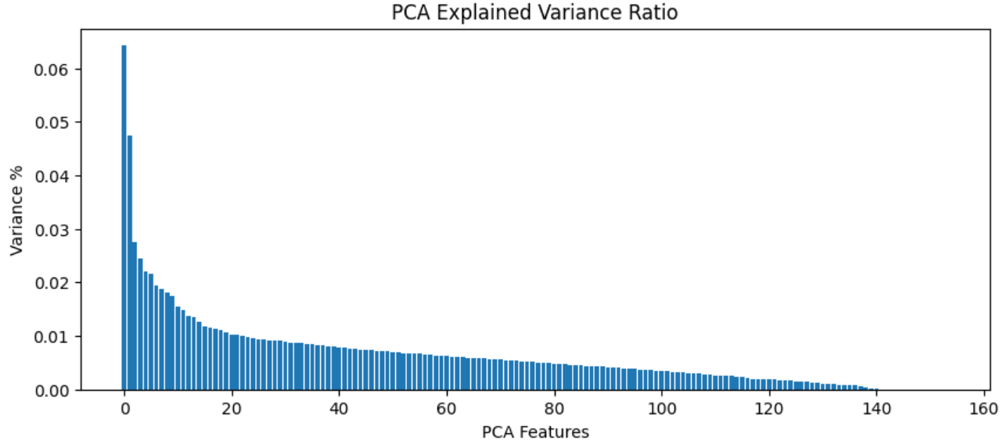
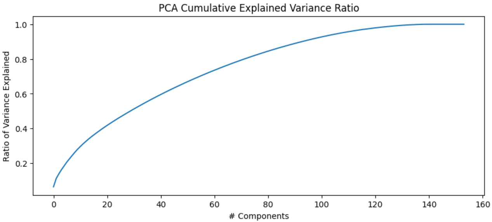
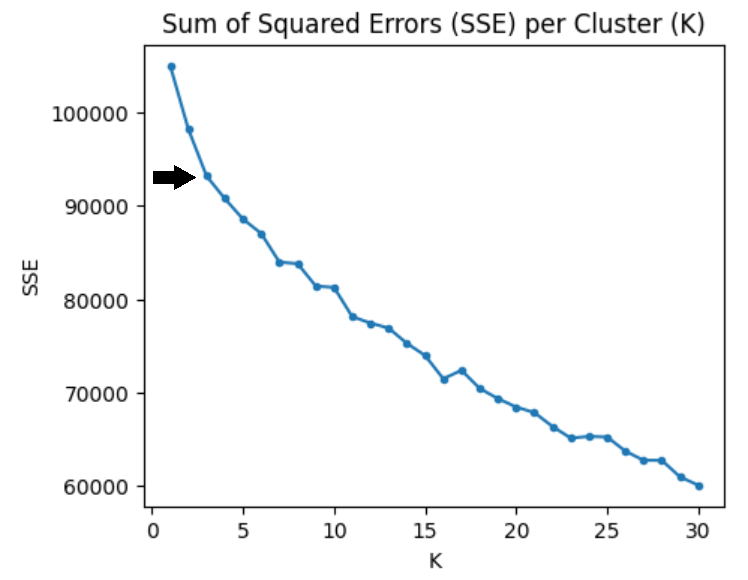
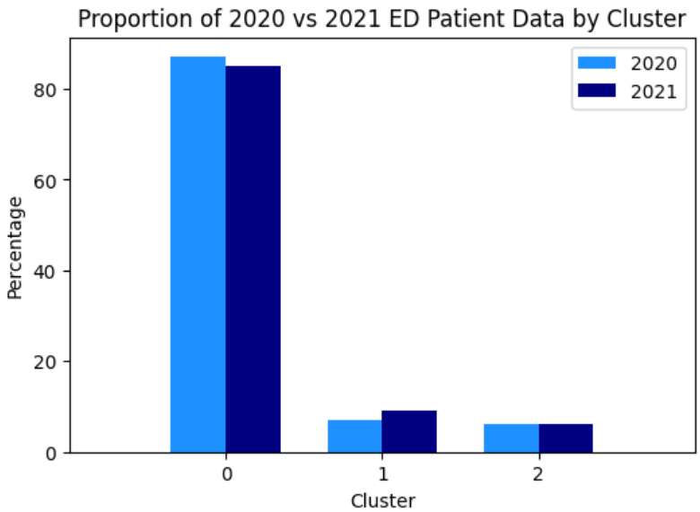
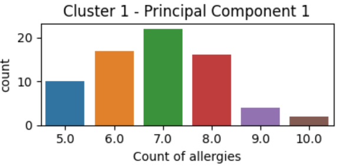
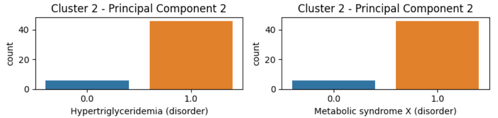
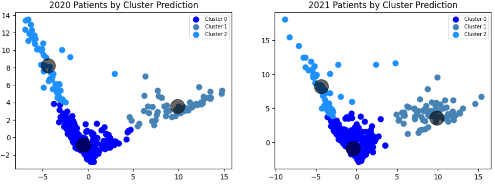
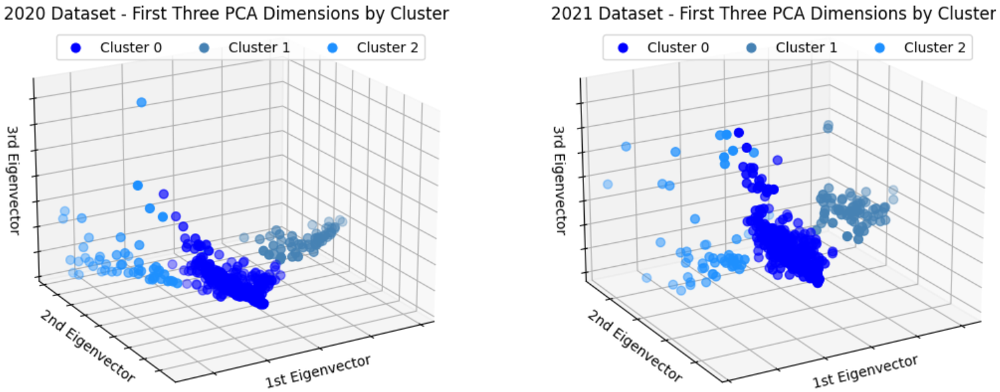

# Emergency Department Patient Segmentation  Using Unsupervised Machine Learning Techniques  
WGU - BS Data Analytics Capstone Project  
Amanda Hanway - 3/2/2024  

## Introduction   
Visits to the Emergency Department (ED) generate costly bills for both the patient and their healthcare payer. In many cases, steps can be taken to prevent a potential medical emergency, such as taking prescribed medications and regularly seeing a Primary Care Provider for checkups.  
 
This project will focus on identifying patterns among individuals who visited the ED. Armed with this insight, the healthcare payer can take pre-emptive action to prevent emergency encounters as a cost-savings measure.  

## Links  
- Python Code: [View Capstone.ipynb](Capstone.ipynb)  
- Data Files: [View Data](data)  
  - The data for this project was provided by Synthea, an open-source, synthetic patient generator. The datasets mimic Electronic Health Records (EHR) to provide realistic (but not real) medical history for synthetic patients, enabling Health IT research and development. Source: https://synthetichealth.github.io/synthea/  
- Project Report: [View the Full Written Report](Data%20Analytics%20Capstone%20Project%20Report%20AH.pdf)  

## Project Highlights 

### Research Question or Organizational Need
This project addressed the research question, “What shared characteristics are present among patients with emergency encounters?” This question was brought about by the organizational need for healthcare payers to identify individuals with a higher propensity to experience an emergency encounter. Armed with this insight, the healthcare payer can take pre-emptive action to prevent the encounter as a cost-savings measure. 
  
### Overview of Data Analytics Solution
The data analytics solution included the use of Exploratory Data Analysis (EDA), Principal Component Analysis (PCA), Unsupervised Machine Learning, and aspects of project management. The python programming language and python libraries such as pandas, numpy, matplotlib, sklearn, and seaborn were used within a JupyterLab environment to conduct analysis and develop the model.  

EDA was first conducted on a dataset of synthesized Electronic Health Records to understand its characteristics and identify underlying issues. Following the data cleaning and feature engineering steps identified through EDA, PCA was applied to the data to investigate and select important features. The data was then trained using the K-Means Clustering model. The initial model was developed, then tuned in iterations using the Agile project management methodology. The final model was applied to a second, unseen dataset, and the results were evaluated.  

### Data Selection and Collection
The data was downloaded from the Synthea website in two zipped folders which contained 16-18 files each. After reviewing the files individually in Excel, the five following files were chosen for further use in the model: 
1.	allergies.csv
2.	careplans.csv
3.	conditions.csv
4.	encounters.csv
5.	patients.csv

### Exploratory Data Analysis
EDA was the first analytic technique performed on the dataset. This was a crucial first step that revealed insight into the file contents: number of data points available, data formats, patient demographics, types of conditions, allergies, and encounters represented. Information gained from EDA determined the data cleaning and feature engineering steps that would be required before further developing the model. 

### Data Cleaning & Feature Engineering
The cleaning and engineering steps required to transform data elements into data types appropriate for a machine learning model were as follows:
- Removed patients who did not have an emergency encounter
- Summarized counts of each encounter class per patient
- Summarized conditions per patient
- Created a column for patient age
- Identified and removed outliers for patient age
- Created patient age numerical categories
- Created healthcare expense numerical categories
- Created gender numerical categories
- Created race numerical categories
- Created county numerical categories
- Created a careplan indicator
- Created allergy one-hot encoded columns
- Joined datasets together into one main dataset
- Assessed and handled missing data
- Identified and removed outliers for emergency encounters

### Principal Component Analysis
PCA was performed in combination with feature scaling. After the data cleaning and feature engineering steps concluded, the following steps were taken to scale features and conduct PCA: 
- Feature Scaling: Feature scaling was a critical step before PCA. By rescaling all features to a standard deviation of 1 and a mean of 0, this step ensured that variances subsequently calculated in PCA were not influenced by differences in scale. The scikit-learn StandardScaler class was utilized.
- PCA: The scikit-learn PCA class was applied to the scaled data. The explained variance ratios were plotted in a bar chart and the cumulative explained variance ratios were plotted in a scree plot to investigate the results. After reviewing the charts, 80 components, which explained 80% of the variance, were chosen as an optimal number to retain for the model. The data was again run through PCA using the parameter of 80 components to be retained. The features making up the first three principal components were then extracted and their weights were examined to generate an analysis.

#### Principal Component Analysis Results:
1st Principal Component
- The first principal component is correlated with total count of allergies, dander allergy, and mold allergy. As these variables increase, the principal component increases.  
  
2nd Principal Component
- The 2nd principal component is correlated with Hypertriglyceridemia, Metabolic syndrome X, and Diabetes. As these variables increase, the principal component increases.  

3rd Principal Component
- The 3rd principal component is correlated with suspected lung cancer and Carcinoma in situ of prostate. As these variables increase, the principal component increases.  

### K-Means Model
The K-Means clustering algorithm was leveraged to perform unsupervised machine learning. The scikit-learn KMeans class was fit to the PCA data for a range of one to 30 clusters, and the resulting Sum of Squared Errors (SSE) scores and Silhouette Scores were extracted for each number of clusters. The SSE for each model was plotted in a line chart. The models were evaluated using Elbow Criterion on the SSE chart, in combination with the Silhouette Scores. Based on the results, three clusters were chosen as the optimal number of clusters for the final model. The final model was fit to the PCA data again, using the parameter of three clusters.  

### Model Application 
Applying the trained model to the second patient dataset identified interesting patterns among the population. 

The largest cluster was Cluster 0 with 677 patients, followed by Cluster 1 with 71 patients and Cluster 2 with 52 patients. The proportion of patients in each cluster was similar between the two datasets.  

The following prominent characteristics were identified for each cluster:

- Cluster 0 was driven by lack of or minimal presence of allergies, Hypertriglyceridemia disorder, Metabolic syndrome X, Suspected lung cancer or Carcinoma in situ of prostate.

- Cluster 1 was driven by presence of allergies. All patients in this cluster had at least five allergies.

-	Cluster 2 was driven by presence of Hypertriglyceridemia disorder or Metabolic syndrome X. Most of the patients in this cluster had at least one of these conditions. 

#### Patients Plotted by Cluster

##### Scatter Plots 

#### 3D Scatter Plots

### Conclusions  
The goal of this project was to identify shared characteristics among patients who had an emergency encounter. A patient dataset was identified, collected, cleaned, and then underwent Principal Component Analysis to select for an optimal number of components. Following PCA, the K-Means model was trained on a range of clusters, and then assessed to select for an optimal number of clusters. The final model was then applied to a new dataset for evaluation. 

The machine learning model performed at a fair level with a Silhouette Score of 0.29, indicating the model clustered data points that were of a reasonable (but not strong) match to other data points in the same cluster. The conclusion drawn from the score suggests there is still room for further work to be done to refine and improve the model. 

Even so, applying the trained model to the second patient dataset identified interesting patterns among the population.  

### Limitations
A limitation of the model and analysis was the dataset. Given that the data was synthetic, it may not truly represent patterns in patients who have emergency encounters. Additionally, it is unknown if the 2020 and 2021 datasets were comprised of the same patients or a different group of patients.

### Future Work
An area for future work to improve the model is to develop condition groupers where each condition is assigned to a category made up of other similar conditions. The assumption is that this method would create more, smaller clusters, which would be made up of patients that share more-similar characteristics than the current method where each condition is treated separately.

 
 
 
 
 
 
